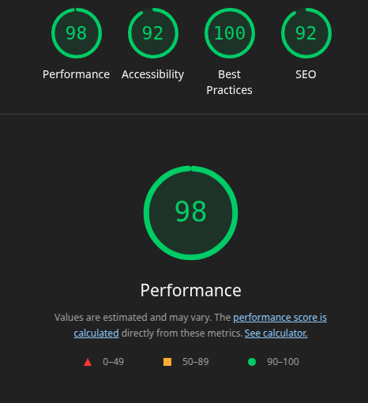
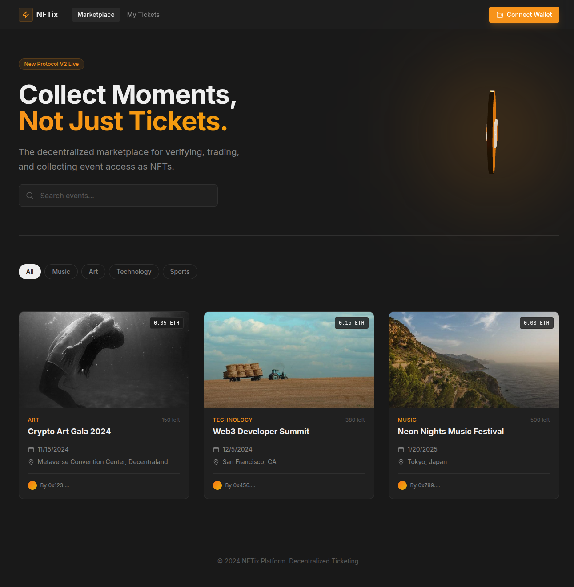
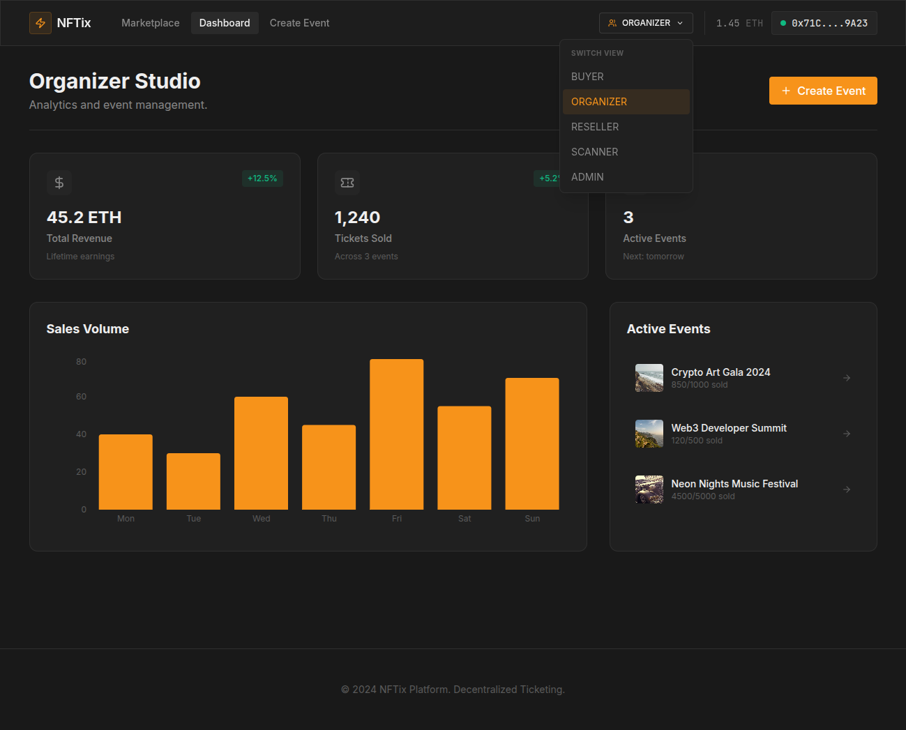
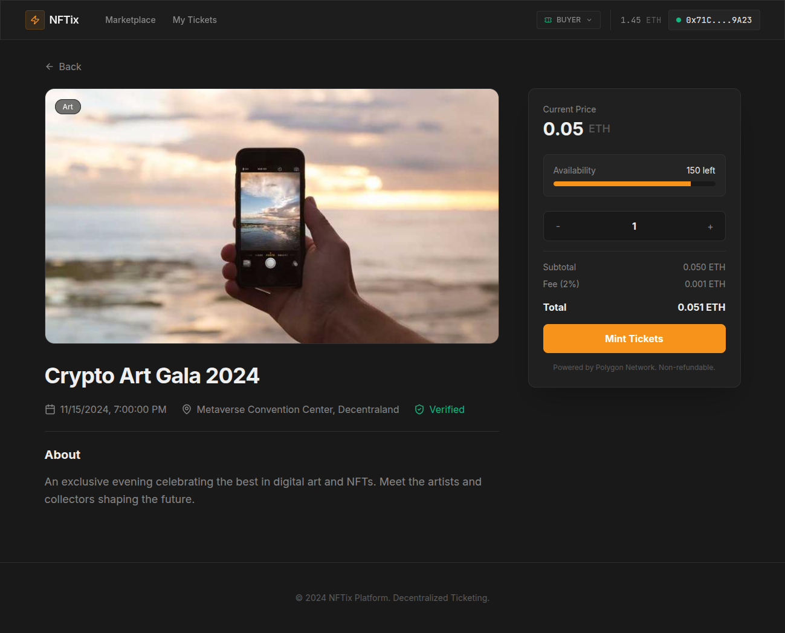
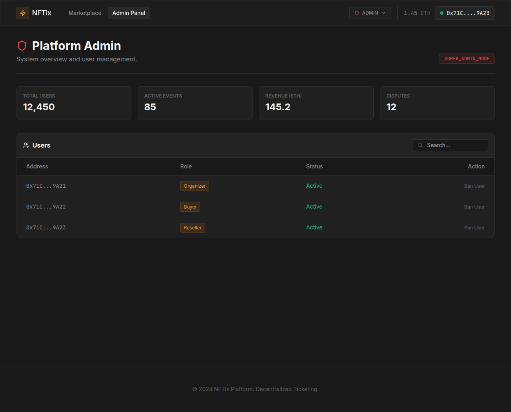

# NFT-TICKETING

## 🎟️ Web3 Ticketing Platform

A decentralized application (dApp) for buying, selling, and managing event tickets as NFTs. This platform leverages blockchain technology to ensure transparency, security, and true ownership of tickets.

## 🌟 Features

- **Decentralized Ticketing**: Tickets are minted as NFTs.
- **User Dashboard**: Manage your tickets and events.
- **Admin Panel**: Comprehensive controls for platform administrators.
- **High Performance**: Optimized for speed and user experience.

## 📸 Screenshots

## 🚀 Performance

We prioritize performance and accessibility.

### Home Page
The landing page of the application, showcasing featured events and easy navigation.

### Dashboard
User dashboard for managing purchased tickets and viewing account details.

### Ticket Sale Page
Interface for users to purchase tickets for specific events.

### Admin Panel
Administrative interface for managing events and platform settings.

## Run Locally

**Prerequisites:**  Node.js

1. Install dependencies:
   `npm install`
2. Run the app:
   `npm run dev`
